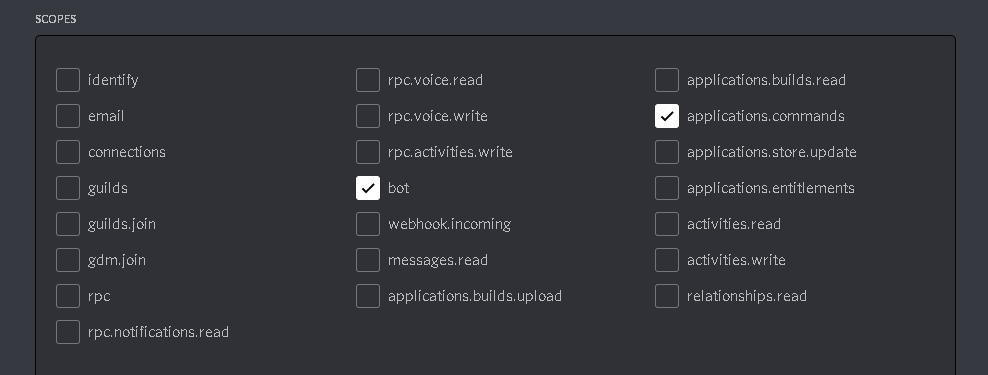

<br />
<p align="center">
    <h2 align="center">discord-ui</h2>
    <p align="center">
        A discord.py user-interface extension
        <br />
        <a href="https://pypi.org/project/discord-ui/"><b>pip package</b></a> 
        ▪ 
        <a href="https://discord-ui.readthedocs.io/en/latest/"><b>read the docs</b></a> 
        ▪ 
        <a href="https://github.com/discord-py-ui/discord-ui/tree/main/examples"><b>examples</b></a>
    </p>
</p>

[](https://pepy.tech/project/discord-ui)

## Introduction

This is a [discord.py](https://github.com/Rapptz/discord.py) ui extension made by [404kuso](https://github.com/404kuso) and [RedstoneZockt](https://github.com/RedstoneZockt)
for using discord's newest ui features like buttons, slash commands and context commands (we got dpy2 supported if you want to keep using our libary)

Our libary overrides some of the functions in dpy, so this lib is easier to use.
The `Messageable.send` function and the `Webhook.send` are 
both overriden with our own custom method. 
`discord.ext.commands.Bot` is overriden too, but only if you use dpy 2
in order for our lib to work, so if you (somewhy) wanna check the type of the client, you need to 
use `isinstance(your_client, discord.ext.commands.Bot)`, because `type(your_client)` will be of type `OverridenV2Bot`

For more information about overriding, take a look at the [override module](https://github.com/discord-py-ui/discord-ui/blob/main/discord_ui/override.py)


## Installation

```cmd
# windows
py -m install discord-ui

# linux
python3 -m pip install discord-ui
```

## Docs

You can read the docs [here](https://discord-ui.readthedocs.io/)

> The docs can include some typos or issues, if so, plz let me know

## License

This project is under MIT License

## Issues

If you find any issues, please report them 

https://github.com/discord-py-ui/discord-ui/issues

## Note

If you want to use slash commands, in the oauth2 invite link generation, 
you have to check both `bot` and `application.commands` fields



## Example


Example for creating a simple slash command
```py
import discord
from discord.ext import commands
from discord_ui import UI, SlashOption

client = commands.Bot(" ")
ui = UI(client)

@ui.slash.command("hello_world", description="a simple slash command", options=[SlashOption(bool, "cool", "whether this libary is cool", required=False)], guild_ids=["785567635802816595"])
async def command(ctx, cool=True):
    await ctx.respond("You said this libary is " + str(cool))

await client.run("your_token")
```

Example for sending a button and receiving it

```py
import discord
from discord.ext import commands
from discord_ui import UI, LinkButton, Button

from asyncio import TimeoutError

client = commands.Bot(" ")
ui = UI(client)

@client.listen("on_message")
async def on_message(message: discord.Message):
    if message.content == "!btn":
        msg = await message.channel.send("you", components=[
            [Button("custom_id", "press me", color="green"), LinkButton("https://discord.com", emoji="😁")],
            Button("my_custom_id")
        ])
        try:
            btn = await msg.wait_for(client, "button", timeout=20)
            await btn.respond("you pressed `" + btn.content + "`")
        except TimeoutError:
            await msg.delete()

client.run("your_token_here")
```

Example for sending Selectmenus and receiving them

```py
import discord
from discord.ext import commands
from discord_ui import UI, SelectMenu, SelectOption

from asyncio import TimeoutError

client = commands.Bot(" ")
ui = UI(client)

@client.listen("on_message")
async def on_message(message: discord.Message):
    if message.content == "!sel":
        msg = await message.channel.send("you", components=[SelectMenu("custom_id", options=[
            SelectOption("my_value", label="test", description="this is a test"),
            SelectOption("my_other_value", emoji="🤗", description="this is a test too")
        ], max_values=2)])
        try:
            sel = await msg.wait_for(client, "select", timeout=20)
            await sel.respond("you selected `" + str([x.content for x in sel.selected_values]) + "`")
        except TimeoutError:
            await msg.delete()

client.run("your_token_here")
```

You can find more (and better) examples [here](https://github.com/discord-py-ui/discord-ui/tree/main/examples)

# Changelog


-   <details>
    <summary>3.2.7</summary>

    ## **Added**
    - warnings
        - When a guild_permission with an invalid guild id is passed, it will throw an exception when syncing the commands
        - When the value of a guild_permission is not of type `SlashPermission` it will throw an exception
    - context-commands
    > You can now have context commands with the same name as a normal slash command

    ## **Changed**
    - auto_defer
    > auto_defer is now disabled by default
    - slash sync
    > You can now disable auto_sync for slash commmands and sync them by yourself with `Slash.sync_commands(delete_unused)`
    - Interacion.defer
    > `Interaction._deferred` is not `Interaction.deferred` and `Interaction.defer()` doesn't throw an exception anymore, it will just log the error with `logging.error()`

    ## **Fixed**
    - try
    > There was a try/catch in the `Interaction.respond` function that would allow the code to continue when an exception occured while responding with ninja_mode
    - context commands
    > There was an issue adding context-commands

    </details>

-   <details>
    <summary>3.2.6</summary>

    ## **Added**
    - auto ninja_mode
    > If you use `.respond()`, the function will try to use ninja_mode automatically

    ## **Changed**
    - project
    > Moved git-project to https://github.com/discord-py-ui/discord-ui

    ## **Fixed**
    - ninja_mode response
    > responding with ninja_mode would end up in an exception

    - file sending
    > fixed another file sending issue with slash commands

    </details>

-   <details>
    <summary>3.2.5</summary>

    ## **Fixed**
    - #89 (thanks for reporting)

    </details>

-   <details>
    <summary>3.2.4</summary>

    - Fixed version issues with the package

    </details>

-   <details>
    <summary>3.2.2</summary>

    ## **Fixed**
    - #85: `AttributeError: module 'discord' has no attribute '_Components__version'`

    </details>

-   <details>
    <summary>3.2.0</summary>

    ## **Fixed**
    I'm really sorry for all the issues this libary got, if you still find issues, please report them in https://github.com/discord-py-ui/discord-ui/issues

    - SelectOpion
    > There was an issue with emojis not being set in SelectOptions

    - LinkButton
    > There was an issue with setting the url not being set

    - SlashCommands
    > There was an issue with creating commands that don't already exist

    ## **Changed**
    - SelectedMenu
    > `.values` is not `.selected_values`

    ## **Added**
    - Interaction
    > Buttons and SelectMenus have a `.message` property for the message where their interaction was creted
    > ResponseMessages have a `.interaction` property for the received interaction
    
    - Events
    > We added a `interaction_received` event for all interactions that are received

    

    </details>

-   <details>
    <summary>3.1.0</summary>

    ## **Added**
    - discordpy 2 support
    > We added support for discord.py v2, so you can stay loyal to our libary and use it together with discord.py v2!
    
    - Exceptions
    > Added own Exceptions for errors
    
    - ParseMethod
    > You can change the way the extension parses interaction data. You can choose between [different Methods](https://discord-ui.rtfd.io/en/latest/ui.html#id1)
    
    - Auto-defer
    > The libary will autodefer all interactions public. If you want to change that, take a look at [the documentation for this feature](https://discord-ui.rtfd.io/en/latest/ui.html#id2)
    
    - slashcommand edit check
    > Slash commands will only be edited if there were some changes, so you won't get a `invalid interaction` error in discord after starting the bot
    > If only permissions were changed, just the permissions will be edited and not the whole command like before

    ## **Fixed**
    - slash commands
    > I finally fixed the damn slashcommand system, it should work now

    - Parsing
    > The resolving, fetching and pulling from the cache methods should all work

    </details>

-   <details>
    <summary>3.0.1</summary>
    
    ## **Fixed**
    - small project issues

    </details>

-   <details>
    <summary>3.0.0</summary>

    ## **Added**

    - context commands
    > Context commands are now available

    ## **Changed**

    - Project name
    > The project's name was changed from `discord-message-components` to `discord-ui`

    - ``Extension`` is now ``UI``

    </details>

-   <details>
    <summary>2.1.0</summary>

    ## **Added**

    - Webhook support
    > You are now able to use webhooks together with message components, to send a webhook message with the components, use the `Components.send_webhook` function.
    The standart webhook function is also overriden with the new component function

    - Float type
    > You can now use `float` as the argument type for a slash command option

    - Auto empty names
    > Buttons, LinkButtons and SelectOptions labels are now by default `\u200b`, which is an "empty" char 

    ## **Changed**

    - Code documentation to more be more informative

    ## **Fixed**

    - Fixed small code issues (they were already fixed in previous versions, but I just wanna list this here)

    - Docs are now working

    </details>

-   <details>
    <summary>2.0.2</summary>

    ## **Fixed**

    - SelectOption
    > Select option threw an exception if it was smaller than 1 or higher than 100

    </details>

-   <details>
    <summary>2.0.0</summary>
    
    ### **Added**
    - Slashcomamnd support
        - `Slash` class for slash commands
        - `Slash.command`, `Slash.subcommand` and `Slash.subcommand_groups` are available for creating slash commands
        - `SlashedCommand` and `SlashedSubCommand` are there for used slash commands 
    
    - ``Message``
        - disable_action_row(row_numbers: `int` | `range`, disable: `bool`)
        > disables (enables) component row(s) in the message
        
        - disable_components(disable: `bool`)
        > disables (enables) all componentss
    
    - overrides
        - `Messageable.send` returns Message instead of discord.Message and takes components parameter
        - `override_client` function added
    
    - `interaction.send`, creates followup messages which can be hidden
    
    - `Component.listening_component`
    > A listening component with a callback function that will always be executed whenever a component with the specified custom_id 
    was used


    ## **Changed**
    - Message
        
        - All Message objects don't use the client object anymore
        - Message.wait_for now needs the client as the first parameter


    ## **Fixed**
    - Interaction
    > All interaction responses work now
    - A lot of issues I fogor💀

    </details>

-   <details>
    <summary>1.2.2</summary>

    ### **Fixed**
    - Docs fixed

    </details>

-   <details>
    <summary>1.2.1</summary>

    ### **Fixed**
    - Small code fixes

    </details>

-   <details>
    <summary>1.2.0</summary>

    ### **Added**
    - Complete message component suppport
    - Select menus
    - [documentation](https://discord-ui.readthedocs.io/en/latest/)
    
    </details>

-   <details>
    <summary>1.1.2</summary>

    ### **Fixed**
    - Small code fixes

    </details>

-   <details>
    <summary>1.1.1</summary>

    ### **Added**
    - Message.edit()
        > You can now edit messages with button support

    </details>


-   <details>
    <summary>1.1.0</summary>

    ### **Changed**
    - Major changes to request code, now using the client's request
    - `ResponseMessage.acknowledge()` -> `ResponseMessage.defer()`
        > Changed the name of the function + changed `ResponseMessage.acknowledged` -> `ResponseMessage.deferred`
    - `ResponseMessage.defer()` => `await ResponseMessage.defer()`
        > `defer` (`acknowledge`) is now async and needs to be awaited

    ### **Added**
    - hidden responses
        > You can now send responses only visible to the user
    

    ### **Fixed**
    - `ResponseMessage.respond()`
        > Now doesn't show a failed interaction
 

    </details>

-   <details>
    <summary>1.0.5</summary>
    
    ### **Fixed**
    - `ResponseMessage.respond()`
        > responding now doesn't fail after sending the message, it will now defer the interaction by it self if not already deferred and then send the message

-   <details>
    <summary>1.0.4</summary>
    
    ### **Added**
    - `ResponseMessage.acknowledged`
        > Whether the message was acknowledged with the `ResponseMessage.acknowledged()` function

    ### **Changed**

    - `ResponseMessage.respond()` => `await ResponseMessage.respond()`
        > respond() function is now async and needs to be awaited

    - `ResponseMessage.respond() -> None` => `ResponseMessage.respond() -> Message or None`
        > respond() now returns the sent message or None if ninja_mode is true 

    </details>

-   <details>
    <summary>1.0.3</summary>

    ### **Added**
    - `Button.hash`
        > Buttons have now a custom hash property, generated by the discord api 
    
    </details>


## Contact

You can contact us on discord

- `RedstoneZockt#2510`
- `! ♥UwU kuso-kun UwU 💕#6969`
- [a shitty support server](https://discord.gg/bDJCGD994p)
