=================
Usage
=================

Get started
=====================

At first, you need to import the discord.py package and this package

.. code-block::

    import discord
    from discord.ext import commands
    from discord_ui import Components

Create a new discord client

.. code-block::

    client = commands.Bot(" ")

.. warning::

    Note that the discord client has to be of type :class:`discord.ext.commands.Bot`, or else it won't work properly

Then you need to create a new :class:`~UI` instance, with which you can use message components and slash commands

.. code-block::

    ui = UI(client)

.. important::

    If you initalize the UI instance, you can choose if you want to override some of discord.py's default functions or not.
    In this tutorial, we will show both methods, one with the overriden methods and one with the not overriden methots.
    The only difference will be that if you want to send components in a webhook, etc., you can use the ``.send`` method, 
    because it is replaced with our own custom method. If you choose not to override dpy, you need to use ``ui.components.send`` 
    or ``ui.components.send_webhook`` instead.

Message-components
=====================

Sending
~~~~~~~~~~~~~~~~~~~~~~

To send a component, we need to acces our :class:`~Components` class with ``ui.components`` and use the ``.send()`` function of it 

In this example, we'll wait for a message with the content "!test"

.. code-block::

    @client.listen()
    async def on_message(message):
        if message.content == "!test":
            ...

Now we will send a component to the text channel where the *"!test"* message came from

Let's say we want to send two buttons and a select menu

We need to import them at first. For that, we need to go back to the beginning, where we imported the module

.. code-block::

    import discord
    from discord.ext import commands
    from discord_ui import Components, Button, SelectMenu, SelectOption

And to send them, we use

**Default**

.. code-block::

    ...
    await ui.components.send(message.channel, "Hello World", components=[
        Button("press me", "my_custom_id", "green"),
        Button("or press me!", "my_other_custom_id", emoji="😁", new_line=True),
        SelectMenu(options=[
                SelectOption("choose me", 1),
                SelectOption("or me", 2),
                SelectOption("or me", 3)
        ], "another_custom_id", placeholder="Select something")
    ])

**Overriden**

.. code-block::

    ...
    await message.channel.send(message.channel, "Hello World", components=[
        Button("press me", "my_custom_id", "green"),
        Button("or press me!", "my_other_custom_id", emoji="😁", new_line=True),
        SelectMenu(options=[
                SelectOption("choose me", 1),
                SelectOption("or me", 2),
                SelectOption("or me", 3)
        ], "another_custom_id", placeholder="Select something")
    ])

The message

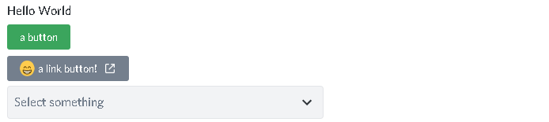

The select menu

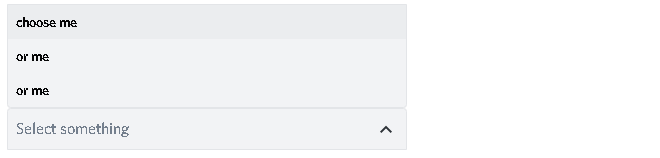

.. note::

    Instead of using `new_line=True`, you can either put all components you want to have in one line into a list

    .. code-block::

        components=[[Button(...), Button(...)], LinkButton(...)]

    or put them into an :class:`~ActionRow`

    .. code-block::

        components=[ActionRow(Button(...), Button(...)), LinkButton(...)]

Now that we sent some components, how do we receive them?

Receiving
~~~~~~~~~~~~~~~

To receive a button press or a selection, we can listen to the ``button`` and the ``select`` events

**Button**

.. code-block::

    @client.listen('on_button')
    async def on_button(btn):
        # respond
        await btn.respond("you clicked on " + btn.component.content)

To get the user who pressed the button, you use ``btn.author``.
If you want to acces the message on which the button is, you use ``btn.messsage``.

**Select menu**

.. code-block::

    @client.listen('on_select')
    async def on_menu(menu):
        # respond
        await menu.respond("you selected " + ', '.join([value.content for value in menu.selected_options]))
 
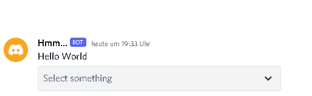

To get the user who selected a value, you use ``menu.author``.
To get the value(s) selected by the user, you need to acces ``menu.selected_values``

.. code-block::

    async def component_callback(component):
        await component.respond("yo")

where the ``component`` parameter the pressed button or the selected menu
 

Easier ways
~~~~~~~~~~~~

But there are some more ways to receive and respond to them

You can send a message and directly wait for a button press and respond to it

**Default**

.. code-block::

    @client.listen()
    async def on_message(message):
        if message.content == "!test":
            btn = await (
                await ui.components.send(message.channel, "hello", components=[
                    Button("there", "custom_id")
                ])
            ).wait_for("button", client)
            await btn.respond("you pressed a button")

**Overriden**

.. code-block::

    @client.listen()
    async def on_message(message):
        if message.content == "!test":
            btn = await (
                await message.channel.send(message.channel, "hello", components=[
                    Button("there", "custom_id")
                ])
            ).wait_for("button", client)
            await btn.respond("you pressed a button")

And we got listening components with a function that will always be executed if a component with a special custom_id was pressed

.. code-block::

    @ui.components.listening_component(custom_id="listening")
    async def listening_component(component):
        await component.respond("we got a component in the message " + str(component.message.id))

Sending the components

**Default**

.. code-block::

    @client.listen()
    async def on_message(message):
        if message.content == "!test":
            await message.channel.send(message.channel, "listening", components=[
                    Button("hi there", "listening"),
                    SelectMenu(
                        options=[
                            SelectOption(label="This is a option", value="my_value", description="This is the description of the option")
                        ], custom_id="listening"
                    )
                ]
            )

**Overriden**

.. code-block::

    @client.listen()
    async def on_message(message):
        if message.content == "!test":
            await message.channel.send(message.channel, "listening", components=[
                    Button("hi there", "listening"),
                    SelectMenu(options=[SelectOption(label="This is a option", value="my_value", description="This is the description of the option")], "listening")
                ]
            )

Slash-commands
====================

.. important::

   If you want to use slash commands, in the oauth2 invite link generation, 
   you have to check both ``bot`` and ``application.commands`` fields

   .. image:: images/slash/invite_scope.png
      :width: 900

To create a new slash command, we need to acces the ``slash`` attribute from the initialized ``ui``

Basic command
~~~~~~~~~~~~~~

.. warning::

    If you want to test slash commands, use ``guild_ids=[guild ids to test here]``, because if you use global commands, 
    it will take some titme to create/update the slash command (`discord api docs reference <https://discord.com/developers/docs/interactions/application-commands#making-a-global-command>`__)

In this example, we will create a simple slash command

.. code-block::

    @ui.slash.command(name="test", description="this is a test command", guild_ids=[785567635802816595])
    async def command(ctx):
        ...

The command in discord would be

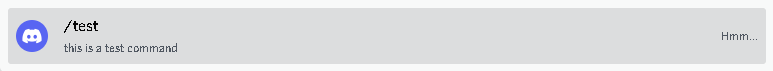

.. note::

    Replace ``785567635802816595`` with your guild id

Parameters
~~~~~~~~~~~~~~

To add parameters to the command, we change the code and use the ``options`` parameter

It acceps a list of :class:`~SlashOption`

.. code-block::

    @ui.slash.command(name="test", description="this is a test command", options=[
            SlashOption(int, name="parameter1", description="this is a parameter")
        ], guild_ids=[785567635802816595])
    async def command(ctx, parameter1="nothing"):
        await ctx.respond("I got `" + str(parameter1) + "` for `parameter1`")

This will add a parameter that accepts a number to the slash command

As you can see ``parameter1`` says "optional", which means you can use the command without to specify it

Because the parameter is optional, in the callback defenition, we have to set a default value for ``parameter``, which in this case is "nothing"

.. important::

    The name of the arguments the function accepts have to be the same as the argument name you specify in the discord slash command

Without the parameter

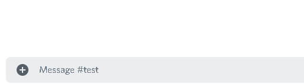

And with

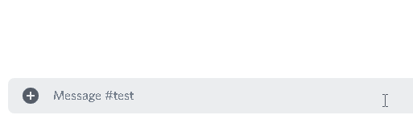

As you can see, we said that the parameter only accepts integers (numbers), and when you try to use a string, it will say *Input a valid integer.*

If you want the parameter to be required, in the option, you have to set ``required`` to ``True``

.. code-block::

    @ui.slash.command(name="test", description="this is a test command", options=[
            SlashOption(int, name="parameter1", description="this is a parameter", required=True)
        ], guild_ids=[785567635802816595])
    async def command(ctx, parameter1):
        await ctx.respond("I got `" + str(parameter1) + "` for `parameter1`")

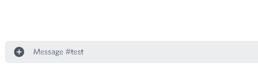

Choices
~~~~~~~~~~

You can add choices for youur options, where the user can choose between a defined list of choices

Too add them, where we add the options with the :class:`~SlashOption` class, we use the ``choices`` parameter and change our code to

.. code-block::

    @ui.slash.command(name="test", description="this is a test command", options=[
                SlashOption(int, name="parameter1", description="this is a parameter", choices=[
                    {"name": "first choice", "value": 1}, {"name": "second choice", "value": 2}
                ])
            ], guild_ids=[785567635802816595])
    async def command(ctx, parameter1="nothing"):
        await ctx.respond("I got `" + str(parameter1) + "` for `parameter1`")

Choices are a list of dict, where ``"name":`` is the displayed choice name and ``"value":`` is the real value, 
which will be received when the choice is selected 

You can also use the ``create_choice`` function to make it easier

.. code-block::

    from discord_ui import create_choice
    ...

    @ui.slash.command(name="test", description="this is a test command", options=[
                SlashOption(int, name="parameter1", description="this is a parameter", choices=[
                    create_choice("first choice", 1), create_choice("second choice", 2)
                ])
            ], guild_ids=[785567635802816595])
    async def command(ctx, parameter1="nothing"):
        await ctx.respond("I got `" + str(parameter1) + "` for `parameter1`")

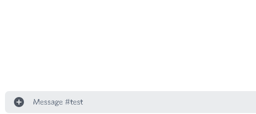

.. note::

    The value of the choice has to be of the same type then the option argument type, which in our case is ``int``, a number

Permissions
~~~~~~~~~~~~

You can set permissions for your commands
There are two ways to set permissions

default permission
--------------------

Default permissions apply to all servers, you can set them either to ``True`` or ``False``

If the default permission to ``False``, no one can use the command, if it's ``True``, everyone can use it

.. code-block::

    @ui.slash.command(name="test", description="this is a test command", options=[
            SlashOption(int, name="parameter1", description="this is a parameter")
        ], guild_ids=[785567635802816595], default_permission=False)
    async def command(ctx, parameter1="nothing"):
        ...

In this example, no one can use the command

guild permissions
------------------

Additionallly, you can use guild permissions, which apply to guilds specified by guild ids

You can add role ids or/and user ids

.. code-block::

    @ui.slash.command(name="test", description="this is a test command", options=[
            SlashOption(int, name="parameter1", description="this is a parameter")
        ], guild_ids=[785567635802816595], guild_permissions={
        785567635802816595: SlashPermission(
            allowed={ 
                "539459006847254542": SlashPermission.USER,
                "849035012476895232": SlashPermission.ROLE
            }, 
            forbidden={ 
                "785567792899948577": SlashPermission.ROLE
            }
        )})
    async def command(ctx, parameter1="nothing"):
        ...

Allowed command

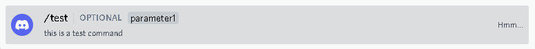

Forbidden command

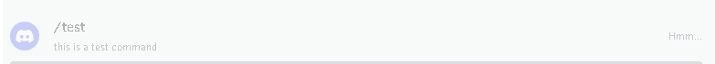

You can later update the command permissions with the :meth:`~Slash.update_permissions` function. 

guild ids
~~~~~~~~~~~

You can decide if you want your commmand only be usable in some guilds you specify or globaly

To set the guilds where the command is useable, you need to set the ``guild_id`` parameter in the slash command to your list of guild ids

.. code-block::

    @ui.slash.command(name="test", description="this is a test command", guild_ids=[785567635802816595])
    async def command(ctx, parameter1="nothing"):
        ...

autocompletion
~~~~~~~~~~~~~~~
You are now able to generate choices for an option based on input, author, channel and more things.

This feature is currently limited to desktop only, mobile clients will treat the option like a normal option.

To use that feature, you need to change two things with :class:`~SlashOption`

.. code-block::

    async def my_generator(ctx: AutocompleteInteraction):
        ...
        return [choices here]

    @ui.slash.command(options=[SlashOption(str, "name", autocomplete=True, generator=my_generator, required=True)])
    async def my_command(ctx, name):
        ...

The callback function needs to return a list of a dict or a tuple that are going to be the choices.

For example

.. code-block::

    async def my_generator(ctx: AutocompleteInteraction):
        ...
        return [{"name": "a choice name", "value": "yeah"}, ("other choice", "other value")]

You can change the options based on the "query" the user has already typed

.. code-block::

    async def my_generator(ctx: AutocompleteInteraction):
        available_choices = ["hello", "hellow", "world", "warudo", "this", "is", "a", "test"]
        return [(x, x) for x in available_choices if x.startswith(ctx.value_query)]

You can also generate choices based on other options that were already selected. 
This example filters user that have the role passed in the "staff" option
.. code-block::

    async def my_generator(ctx: AutocompleteInteraction):
        role: discord.Role = ctx.selected_options["staff"]
        members = role.guild.fetch_members().filter(predicate=lambda x: x.get_role(role.id))
        return [(x.name, str(x.id)) async for x in members]

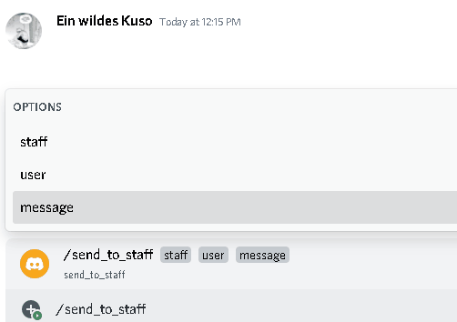

Subcommands, Subcommandgroups and Contextcommands
~~~~~~~~~~~~~~~~~~~~~~~~~~~~~~~~~~~~~~~~~~~~~~~~~~

You can also use subcommands and subcommand groups, they work almost the same as the normal slash command

subcommand
-----------

A subcommand is a slash command with the same base name that can have multiple subcommands

.. code-block::

    base
    |-- subcommand1
    |-- subcommand2

The only difference between ``subcommand`` and ``slashcommand`` is that you got a new ``base_names`` parameter.
This is the name/names of the parent command 

For example

.. code-block::

    @ui.slash.subcommand(base_names="hello", name="world", description="this is a subcommand")
    async def command(ctx):
        ...

would look like this

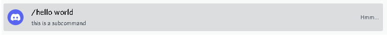

subcommand group
------------------
A subcommand group is a group of subcommands, you could see it like a subcommand of a subcommand

.. code-block::

    base
    |---subcommand
    |   |---subcommand
    |   |---subcommand
    |---subcommand
        |---subcommand

For example

.. code-block::

    @ui.slash.subcommand(base_names=["hello", "beautiful"], name="world", description="this is a subcommand group")
    async def command(ctx):
        ...

Would look like this

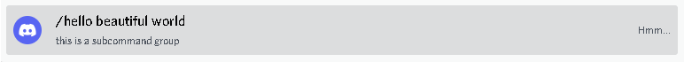

context-commands
-----------------
context-commands are basically slash commands, but focusing on messages and users

To create a message command, which can be used when right-clicking a message, we use

.. code-block::

    @ui.slash.message_command(name="quote")
    async def callback(ctx, message):
        ...

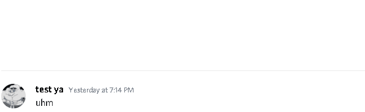

And for a user command, we use

.. code-block::

    @ui.slash.user_command(name="avatar"):
    async def callback(ctx, user):
        ...

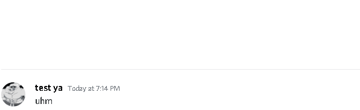

They both work in the same way as slash commands, so responding to them will still be the same, the only differnce are the parameters

.. note::

    ``message`` and ``user`` are just example names for the parameters, you can use whatever you want for them

easier ways
~~~~~~~~~~~~

There are some few things that can be done in easier ways

application-command names and descriptions
--------------------------------------------

If you want to register a slash command, you can leave out the name and description parameter, they will be replaced with the callback function name and the docstring of the callback

.. code-block::

    @ui.slash.command(guild_ids=[785567635802816595])
    async def test(ctx):                  # The name of the slash command will be 'test', because the function's name is test
        """this is a test command"""      # the description of the command will be the docstring
        ...

Same goes for subcommands and context-commands

.. code-block::

    # subcommand
    @ui.slash.subcommand(base_names=["hello"], guild_ids=[785567635802816595])
    async def world(ctx):
        # Note: If you don't pass description and don't use a docstring, the empty description will be replaced with the commands name
        ...

    # context command
    @ui.slash.message_command(guild_ids=[785567635802816595])
    async def quote(ctx, message):
        ...

You can also use the callback's function parameters to specify the slashcommand options

.. code-block::

    @ui.slash.command()
    async def a_command(ctx, some_int = 0): # slashcommand will take an optional option with the name "some_int" of type int
        """this is a command
        
        It will only use the first line for the command description
        """
        # command with the name "a_command", description is "this is a command"
        ...

    @ui.slash.command()
    async def other_command(ctx, user): # slashcommand will take a required option with the name "user" of type user
        """to show a new feature"""
        ...
        # command with the name "other_command", description is "to show a new feature"

    @ui.slash.command()
    async def another_command(ctx, smth: "channel"): # slashcommand will take a required option with the name "smth" of type channel
        """in this libary"""
        ...
        # command with the name "another_command", description is "in this libary"

SlashOption types
-----------------

You can set the type of an SlashOption in various ways

.. code-block::

    SlashOption("int", ...)                         # Option takes an integer
    SlashOption(int, ...)                           # Option takes an integer
    SlashOption(4, ...)                             # Option takes an integer
    SlashOption(OptionType.Integer, ...)            # Option takes an integer
    SlashOption(OptionType.INTEGER, ...)            # Option takes an integer

    # same goes for other types
    SlashOption("user", ...)                        # Option takes a member
    SlashOption(discord.User, ...)                  # Option takes a member
    SlashOption(discord.Member, ...)                # Option takes a member
    SlashOption(6, ...)                             # Option takes a member
    SlashOption(OptionType.User, ...)               # Option takes a member
    SlashOption(OptionType.USER, ...)               # Option takes a member
    SlashOption(OptionType.Member, ...)             # Option takes a member
    SlashOption(OptionType.MEMBER, ...)             # Option takes a member

button colors
--------------

You can set the color of a button with many ways

.. code-block::

    Button(..., color="red")                        # red button
    Button(..., color="rEd")                        # red button
    Button(..., color="danger")                     # red button
    Button(..., color="DANger")                     # red button
    Button(..., color=ButtonStyle.Red)              # red button
    Button(..., color=ButtonStyle.Destructive)      # red button

autocompletion
---------------

For autocompletion you dont have to pass the ``autocomplete`` parameter to the option, 
if you pass ``generator``, ``autocomplete`` will be automatically set to ``True``

.. code-block::

    async def my_generator(ctx: AutocompleteInteraction):
        ...
        return [choices here]

    @ui.slash.command(options=[SlashOption(str, "name", generator=my_generator, required=True)])
    async def my_command(ctx, name):
        ...

You can set set the generator for the autocompletion with a decorator

.. code-block::

    @ui.slash.command(options=[SlashOption(str, "name", required=True)])
    async def my_command(ctx, name):
        ...

    # set the generator
    @my_command.options[0].autocomplete_function        # you could also use my_command.options["name"]
    async def my_generator(ctx: AutocompletInteraction):
        return [...]